<h1 align="left">Hey  I'm Stine Strand</h1>

  

  <a href="https://github.com/stinest-uia">
    

## 🛠️ Languages & Tools

     

### Frontend

   

### Backend

## Database

 

### DevOps & Cloud

### Tools

  

  </a>

## 🔗 Connect with Me

 

<picture>
  <source media="(prefers-color-scheme: dark)" srcset="https://raw.githubusercontent.com/tobiasmeyhoefer/tobiasmeyhoefer/output/github-snake-dark.svg" />
  <source media="(prefers-color-scheme: light)" srcset="https://raw.githubusercontent.com/tobiasmeyhoefer/tobiasmeyhoefer/output/github-snake.svg" />
  
</picture>

